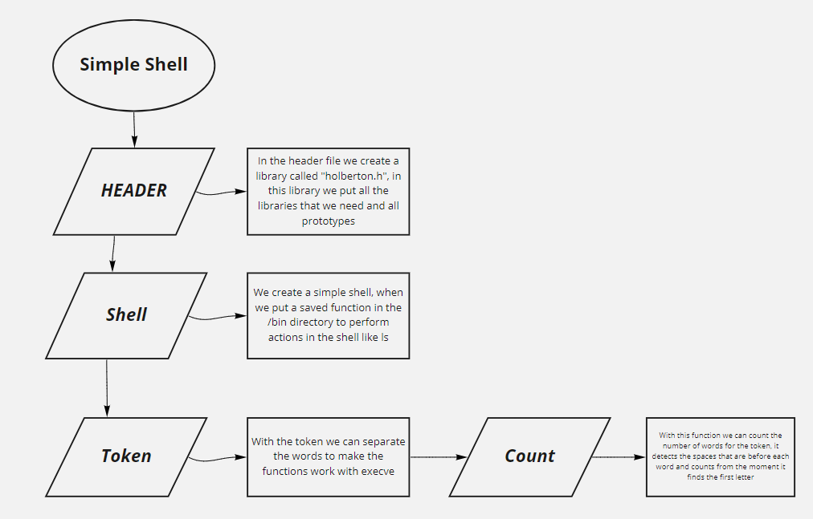

# Simple shell
	A little simple shell.
### Files
	* holberton.h
		- This is the library file.
	* main_shell.c
		- In this file, choose if the user use the interactive mode or non-interactive mode.
	* shell.c
		- In this file is were save the infinite loop, this is the interactive mode.
	* shell_NI.c
		- In this file runs the non-interactive mode.
	* token.c
		- In this file is were we create a tokenizator.
	* count.c
		- In this file is were we create a count for the tokenizator.
	* execute.c
		- In this file can execute all the commands
## Use
	* You can use the files saved in /bin directory.
	* It's a very basic shell, so you can't do as many things as in a normal shell like use the commads ls, pwd, ps, etc.
	* Can run the interactive mode and non-interactive mode
### Examples
	* /bin/ls = Lists the files.
	* /bin/ls -a = List the files including hidden files.
	* /bin/pwd = Show directory path.
## Compilation
	* Your shell will be compiled this way in Ubuntu 14.04 LTS with gcc 4.8.4:
		- gcc -Wall -Werror -Wextra -pedantic *.c
## Flowchart
	* In this flowchart we can se how works our simple shell.
	
#### Credits
	* Sebastian Cardona
	* Juan Duque
	* Mateo Henao